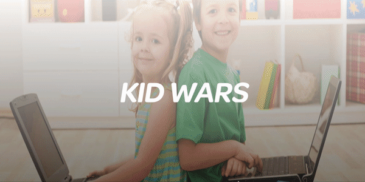
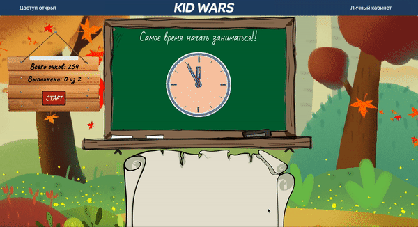
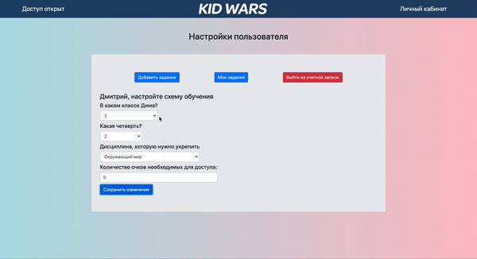

# KID WARS

Приложение создано для помощи родителям в обучении детей.

Основной функционал - бликиовка доступа к ресурсам ПК, до тех пор пока ребенок не выполнит необходимые задания.

Для ребенка ребенка и родителя были предусмотрены разные интерфейсы.

### Для ребенка:

### Для родителя:

Запуск программы: 
> выполнить yarn в корне, папках frontend и backend.
> в одном терминале выполнить dev-server
> во втором терминале выполнить dev-client

Используемые технологии: HTML, CSS, Bootstrap, React, Redux, React-animation, Node js, Express, Mongoose, Electron, Telegram Bot API и другие.

